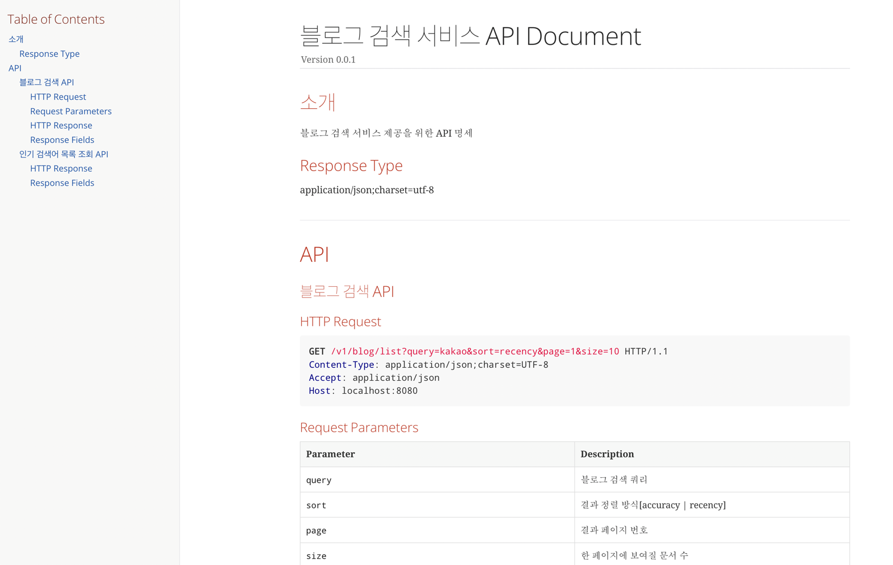

블로그 검색 서비스
==================================

## 프로젝트 소개
이 프로젝트는 카카오 또는 네이버 블로그 검색 API를 이용하여 블로그를 검색하는 서비스입니다.
* [카카오 블로그 조회 API](https://developers.kakao.com/docs/latest/ko/daum-search/dev-guide#search-blog)
* [네이버 블로그 조회 API](https://developers.naver.com/docs/serviceapi/search/blog/blog.md)

## 기능
* **REQUIRED**
    * 블로그 검색 API
    * 인기검색어 조회 API

## 설계 방향
* DDD(Domain-Driven-Design)
    * 블로그 데이터는 JPA를 활용하여 객체(Domain)으로 설계되고 표현됩니다.
    * 당 서비스는 Layered Architecture를 지향하며 다음의 Layer들로 구성됩니다.

| 구분                              | 설명                                                                               |
|:--------------------------------|:---------------------------------------------------------------------------------|
| Presentation Layer(Controller)  | 데이터를 전달하기 위해 화면에 정보를 표시하는 Layer                                                  |
| Business Layer(Service)         | Persistence Layer에서 데이터를 가져와 비즈니스 로직을 수행하고 그 결과를 Presentation Layer 로 전달하는 Layer |
| Persistence Layer(Domain)       | 어플리케이션의 영속성을 구현하는 Layer                                                          |


## 개발환경
**Default**
* JAVA 17
* Spring
    * Spring Boot 2.7.4
    * Spring Data JPA
* DB
    * H2 

**외부 라이브러리**
* Spring Cloud OpenFeign
  * 사용 목적 : 외부 API 통신 
* Spring RestDoc 
  * 사용 목적 : API 명세
* QueryDSL 
  * 사용 목적 : 동적 쿼리 및 가독성
* Docker
  * 사용 목적 : Redis 컨테이너 사용
  
## **주의사항**
서비스를 정상적으로 이용하기 위해 Docker 설치가 필요합니다.
* [Docker 설치](https://docs.docker.com/desktop/install/mac-install/)

설치 이후 다음 명령어를 실행하면, 로컬에 Redis 컨테이너가 동작합니다.
``` bash
$ docker-compose up -d
```
다음 명령어를 실행하면 Redis 컨테이너를 종료합니다.
``` bash
$ docker-compose down
```

## 빌드 결과물 다운로드 경로

[빌드 결과물](https://github.com/junkyuCode/search-blog-service/releases/tag/v0.0.1)

## **실행 가이드**
당 서비스는 카카오/네이버 OpenAPI를 사용하므로 각 도메인의 인증 키가 필요합니다.

* 카카오의 Rest API 키 획득은 다음 경로 참조 : <https://developers.kakao.com/docs/latest/ko/local/dev-guide>
* 네이버의 Rest API ClientID 및 ClientSecret 획득은 다음 경로 참조 : <https://developers.naver.com/docs/serviceapi/search/blog/blog.md>

각 도메인의 인증 키는 다음과 같은 변수에서 사용하게 됩니다.
* KAKAO_REST_API_KEY
  * 카카오 OpenAPI 사용을 위한 API Key
* NAVER_CLIENT_ID
  * 네이버 OpenAPI 사용을 위한 Client ID
* NAVER_CLIENT_SECRET
  * 네이버 OpenAPI 사용을 위한 Client Secret

### Profile
* 당 서비스에서는 Profile 별로 yml을 별도로 구성하였습니다.
* 실행을 위해서 `local` 프로파일을 지원하고 있습니다.

### Properties
1) 발급받은 Credential 을 실행 시 반드시 옵션에 추가해야 합니다. 그렇지 않을 경우, 서버 에러가 발생합니다.

예시)
```bash
java -jar search-blog-service-0.0.1.jar --spring.profiles.active=local --KAKAO_REST_API_KEY={Your Rest API Key} --NAVER_CLIENT_ID={Your Rest API Client ID} --NAVER_CLIENT_SECRET={Your Rest API Client Secret}
```


## API 명세
어플리케이션 실행 후 아래 링크로 접속하시면 API 명세를 확인할 수 있습니다. 

```html
http://localhost:28080/docs/index.html
```



## 핵심 문제해결 전략
* Profile
    * 환경에 따라 다른 설정을 사용할 수 있도록 yml을 분리하였습니다.
    * 현재 소스에서는 `local` 프로파일의 사용이 가능합니다.
* 설계
    * DDD 패턴을 준수하였습니다.
* DB
    * 요구사항에 따라 in-memory DB인 H2를 사용하였습니다.
* 외부 서비스 연동
    * Spring Cloud에서 제공하는 OpenFeign을 사용하여 외부 서비스 연동 코드를 작성하였습니다.
* 동시성
    * 인기검색어 조회 로직에서 동시성 이슈를 방지하기 위해 Redis를 사용하였습니다.
    * Redis ZSet을 사용하여 랭킹 데이터를 Delivery 합니다.
* Fallback
    * 카카오 API 장애 시 네이버 API를 통해 데이터를 제공하도록 구현하였습니다.
* 에러 핸들링
    * 익셉션 핸들러를 사용하여 정의한 에러코드를 응답할 수 있도록 처리하였습니다.
* 테스트
    * 웹 레이어 및 서비스 레이어의 테스트를 진행하였습니다.
